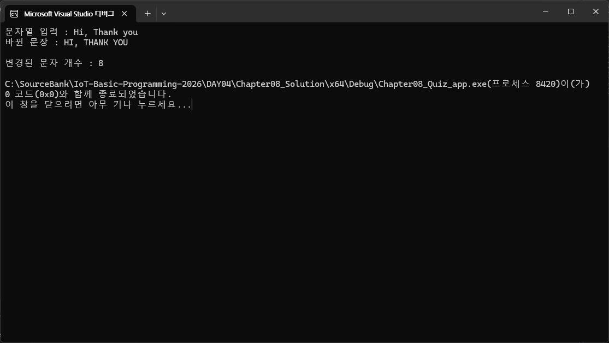

# IoT-Basic-Programming-2026
IoT 개발자 과정 - 기초 프로그래밍 언어 학습 repository

## 1일차
- Git, GitHub Desktop 설치
- Visual Studio Code 설치
- README 미리보기 단축키 => Ctrl + Shift + V

### C언어 학습 순서
- 기본
    1. 프로그램 기본
    2. 상수와 데이터 출력
    3. 변수와 데이터 입력
    4. 연산자
    5. 제어문 ( `분기문`, `반복문` )
    6. 함수

- 고급
    1. 배열
    2. `포인터`
    3. 배열과 포인터
    4. 문자열과 포인터
    5. 변수의 영역과 데이터 공유
    6. 다차열 포인터
    7. 구조체 자료형
    8. 파일 입출력
    9. 전처리와 분할 컴파일

### 프로그램 개요
- 프로그램 : `사용자의 요구`에 따라 `데이터`를 `처리`(표현, 이동, 저장, 로드 등)를 할 수 있는 `소프트웨어`
- 프로그램을 만드는 작업 : 프로그래밍(코딩, SW개발, 소프트 엔지니어 등)

### C 언어
- 1972년 켄 톰슨과 데니스 리치가 UNIX 운영체제 개발을 위해서 만든 언어
- C++, Java, C#, Python 등 모든 언어의 베이스가 되는 언어
- C99 표준에 따라서 학습

### 컴파일과 컴파일러
- 컴파일
    - 소스코드파일(텍스트파일)을 컴퓨터가 실행할 수 있는 파일로 변경, 생성하는 행위
    - 고급언어를 컴퓨터가 알아들을 수 있는 저급언어로 변경하는 행위
    - c, cpp --> 확장자 exe 파일로 생성
- 컴파일러
    - IDE(Integrity Development Enviroment - 통합 개발 도구)를 사용
    - `Visual Studio`, Visual Studio Code, Rider, Eclipse

### Visual Studio Community 설치
- https://visualstudio.microsoft.com/ko/ 경로 이동 후 무료 다운로드 받기 클릭
    1. Visual Studio Installer 실행
        
        
    2. 설치 중
        

### Visual Studio 프로젝트 생성
1. 새 프로젝트 생성
    

2. 새 프로젝트 구성
    - 솔루션 이름, 프로젝트 이름을 다르게 지정
    - 위치는 GitHub 저장소 하위에 위치
    

3. 새 프로젝트 추가
    - 기존 솔루션에 새 프로젝트 추가
    

4. 소스코드 확장자를 변경
    - *.cpp --> *.c 로 변경

5. Chapter01_01_app.c, Chapter01_02_app.c 코딩

6. 메뉴 디버기 > 디버그 하지 않고 시작 (Ctrl+F5) 진행

7. 전체 컴파일 과정
    

8. 프로젝트가 여러개일때
    - 솔루션 속성 > 시작 프로젝트 구성 > `현재 선택 영역`으로 선택

### C 기본 문법
1. 기본 사용법
    - 메인함수 작성법 : [확인](./DAY01/Chapter02_Solution/Chapter02_01_app/main.c)

    - 데이터 출력방법 : [확인](./DAY01/Chapter02_Solution/Chapter02_02_app/main.c)

    - 진법 사용방법 :
        - 2진수 => 컴퓨터의 데이터가 모두 0 ro 1 로만 저장되어 있으므로 사용
        - 8진수 => Bit로 데이터를 처리할 때 Bit 단위가 8이므로 사용
        - 16진수 => 255까지의 수를 짧게 표현하고자 사용
        - 10진수 => 사람이 흔히 사용

    - 진수별 표현법(10, 8, 16) : [확인](./DAY01/Chapter02_Solution/Chapter02_03_app/main.c)
        |10진수|0|1|2|3|4|5|6|7|8|9|10|11|12|13|14|15|
        |:---:|:---:|:---:|:---:|:---:|:---:|:---:|:---:|:---:|:---:|:---:|:---:|:---:|:---:|:---:|:---:|:---:|
        |8진수|0|1|2|3|4|5|6|7|10|11|12|13|14|15|16|17|
        |16진수|0x0|0x1|0x2|0x3|0x4|0x5|0x6|0x7|0x8|0x9|0xA|0xB|0xC|0xD|0xE|0xF|
        

## 2일차

### C 기본 문법2

1. 기본 문법
    - 데이터 타입 : [확인](./DAY02/Chapter03_Solution/Chapter03_01_app/main.c)
    - 실수형 및 변수 : [확인](./DAY02/Chapter03_Solution/Chapter03_02_app/main.c)
    - 데이터 입력 : [확인](./DAY02/Chapter03_Solution/Chapter03_03_app/main.c)

    - 연산자 : [확인](./DAY02/Chapter04_Solution/Chapter04_01_app/main.c)

2. 문제 풀이
    - 1번 문제 : [확인](./DAY02/Chapter04_Solution/Chapter04_quiz_01/quiz01.c)
    - 2번 문제 : [확인](./DAY02/Chapter04_Solution/Chapter04_quiz_01/quiz02.c)
    - 4번 문제 : [확인](./DAY02/Chapter04_Solution/Chapter04_quiz_01/quiz04.c)

## 3일차

### C 기본 문법3

1. 제어문 - 선택문
    - if : [확인](./DAY03/Chapter05_Solution/Chapter05_01_app/main.c)
    - switch-case : [확인](./DAY03/Chapter05_Solution/Chapter05_02_app/main.c)
    
2. 반복문 
    - while, do ~ while : [확인](./DAY03/Chapter05_Solution/Chapter05_03_app/main.c)
    - for : [확인](./DAY03/Chapter05_Solution/Chapter05_04_app/main.c)
    - 구구단 : [확인](./DAY03/Chapter05_Solution/Chapter05_05_app/main.c)
    - 무한루프 : [확인](./DAY03/Chapter05_Solution/Chapter05_06_app/main.c)
    - continue, break : [확인](./DAY03/Chapter05_Solution/Chapter05_07_app/main.c)

3. **`디버깅`** 
    - 단축키
        - F5 : Debugging 시작
               Debug 중일때는 다음 Break Point까지 바로 진행.
        - Shift + F5 : Debugging 종료
        - F9 : `Break Point` Toggle 지정
        - F10 : Debugging 중 Source Code 1줄 실행
        - F11 : Source Code 내 `Function`이나 `Class`가 존재하면 내부로 진입
        - 로컬, 조사식 창 활용

4. 함수 
    - 함수 기본 : [확인](./DAY03/Chapter07_Solution/Chapter07_01_app/main.c)

## 4일차

### C 기본 문법4
1. 함수2
    - 함수 유형 : 
        - 매개변수 없는 함수
        - 반환값이 없는 함수
        - 매개변수와 반환값이 없는 함수
        - `매개변수, 반환값`이 있는 함수 - Chapter07_01_app
    - 재귀호출 함수 : [확인](./DAY03/Chapter07_Solution/Chapter07_03_app/main.c)

2. 배열
    - 동일 자료형의 묶음 - `array[10]`
    - 배열 선언, 초기화 : [확인](./DAY04/Chapter08_Solution/Chapter08_01_app/main.c)
    - 문자배열(문자열) : [확인](./DAY04/Chapter08_Solution/Chapter08_03_app/main.c)
    - 문자열 대소문자 변환 : [확인](./DAY04/Chapter08_Solution/Chapter08_Quiz_app/main.c)

        
    
3. 포인터
    - 변수에 담긴 데이터를 공유하기 위함.
    - 프로그램에서 사용하는 메모리를 절약하기 위한 목적.
    - 변수 스코프 : [확인](./DAY04/Chapter09_Solution/Chapter09_01_app/main.c)
    - 메모리 주소
        - 주소 연산자('&') : [확인](./DAY04/Chapter09_Solution/Chapter09_02_app/main.c)
        - 간접 참조 연산자(포인터 연산자'*') : [확인](./DAY04/Chapter09_Solution/Chapter09_03_app/main.c)

    
## 5일차

### C 기본 문법5

1. 포인터 
    
    - 포인터 이해 : [확인](./DAY05/Chapter09_Solution/Chapter09_04_app/main.c)
        - 변수의 주소(메모리 상)를 담고, 간접 참조 연산자(*)를 그 변수의 값을 사용하기 위한 것
        - 변수의 주소를 변경해서 `여러 변수를 사용가능`
        - 변수의 주소는 바뀌지 않는 값.
        (상수)
        - 프로그램 실행 중에는 변수의 주소는 바꿀 수 없다.(즉, 코드 상에서 변수의 주소 값을 변경하려는 것은 불가하다.)
        - 포인터에 주소를 저장할 때는 자료형이 동일해야함.

    - 포인터 크기 : [확인](./DAY05/Chapter09_Solution/Chapter09_05_app/main.c)
        - 주소의 크기와 동일 : 8byte(64비트 체계)

    - 포인터 사용 이유 : [확인](./DAY05/Chapter09_Solution/Chapter09_07_app/main.c)
        - 용량이 제한된 [임베디드 시스템](https://ko.wikipedia.org/wiki/%EC%9E%84%EB%B2%A0%EB%94%94%EB%93%9C_%EC%8B%9C%EC%8A%A4%ED%85%9C)에서 데이터를 공유하는 목적
        - 함부로 변수를 막 선언하여 만들 수 없음.
        - 주소를 공유해서 함수 어디서나 변수의 값을 변경할 수 있음.
        - 함수 간 효과적으로 데이터를 공유하는 것

2. 배열과 포인터 : [확인](./DAY05/Chapter10_Solution/Chapter10_01_app/main.c)
    - 배열과 포인터는 매우 흡사하여 유사하게 사용이 가능함.
    - scanf() 사용 시 배열 str[80] 선언 후, &str 사용
    - 직접적인 연관이 있음.
    - 실무에서 데이터를 공유하면 일반적으로 배열도 많이 사용됨.
    - 이때, 배열을 매개변수로 그대로 전달하면 메모리 용량을 많이 차지하게 되는 문제가 발생.
    - 이러한 문제를 보완하기 위해 포인터 배열을 사용하여 메모리 용량을 많이 줄이는 방법을 사용.
    - ex. int ary[100] -> main에서 400byte, 함수에서 400byte의 메모리 공간을 차지함.(`메모리 부족사태`)
    - 하지만 int ary[100] -> main에서 400byte, 함수에서 매개변수를 int*(포인터)로 사용할 경우 8byte의 메모리 공간만을 차지.
    - 배열의 주소를 함수에 전달 : [확인](./DAY05/Chapter10_Solution/Chapter10_03_app/main.c)

3. 문자 : [확인](./DAY05/Chapter11_Solution/Chapter11_01_app/main.c)
    - getchar() : 입력 버퍼 한 글자 지우기 : [확인](./DAY05/Chapter11_Solution/Chapter11_02_app/main.c)

4. 문자열 기본 : [확인](./DAY05/Chapter12_Solution/Chapter12_01_app/main.c)
    - 문자열 상수와 문자포인터 변수 사용법

## 6일차 (26/02/09)

### C 중급 문법

1. 문자열과 포인터 : [확인](./DAY06/Chapter12_Solution/Chapter12_02_app/main.c)
    - 문자열 연산 함수 : 자주 사용하는 문자열 처리 내장함수
    - `strlen()`, strcpy(), strncpy(), strcat(), strncat(), strcmp(), strncmp()

2. Tip
    - pragma region, pragma end region :  소스코드 영역에서 일부 내용을 축소(확장) 시키고자 할 때 사용

3. 변수 영역 : [확인](./DAY06/Chapter13_Solution/Chapter13_01_app/main.c)
    - 같은 이름의 변수가 있으면, 코드 블럭 내의 변수가 우선적으로 사용됨.
    - `auto` : 지역 변수를 뜻함. ~~auto~~ 단어 사용하지 않음(생략 가능).
    - global : 전역 변수를 뜻함. ~~glocal~~ 단어 사용하지 않음. 전역변수는 문제가 많아 제한적으로 사용할 것.
    - `static` : 정적 변수를 뜻함. 소스코드 전체가 실행되는 동안 살아있는 변수 [확인](./DAY06/Chapter13_Solution/Chapter13_02_app/main.c)
    - `register` : CPU내 존재하는 메모리를 뜻함. 데이터 처리속도가 가장 빠름. 거의 쓸 일 없음.
    - `extern` : 외부 소스에서 사용할 변수.

4. 데이터 공유 방법 : [확인](./DAY06/Chapter13_Solution/Chapter13_03_app/main.c)
    - 데이터를 필요할 때마다 복사하는 것보다, 같이 공유하는 것이 메모리를 절약하는 방법.
    - 값을 복사해서 전달
    - 주소를 전달
    - 포인터 변수로 return

5. 다차원 배열 : [확인](./DAY06/Chapter14_Solution/Chapter14_01_app/main.c)
    - 1차원 배열 : score[4] - 크기가 4인 배열 score
    - 2차원 배열 : score[4] 배열이 3개 -> score[3][4] == 3행(row) 4열(column)

6. 포인터 배열 : [확인](./DAY06/Chapter14_Solution/Chapter14_02_app/main.c)
    - 2차원 배열과 유사함.

7. 이중 포인터 : [확인](./DAY06/Chapter15_Solution/Chapter15_01_app/main.c)
    - 값은 a = 10 밖에 없으며, 나머지는 모두 주소이다.
    

    - [단일포인터배열](./DAY05/Chapter10_Solution/Chapter10_03_app/main.c)
    VS
    [이중포인터배열](./DAY06/Chapter15_Solution/Chapter15_02_app/main.c) 비교

## 7일차 (26/02/10)

### C 중급 문법2

1. 함수 포인터 : [확인](./DAY07/Chapter15_Solution/Chapter15_03_app/main.c)
    - 함수도 메모리 상에 주소(&)를 가지고 있음.
    - 변수와 동일하게 함수도 주소를 통해서 여러 함수를 변경하여 사용 가능.
    - `어떤 함수를 연결하느냐에 따라 동작이 바뀐다.`
    - 실행 시점에서 어떤 함수가 실행될지 모를 때 - 함수 포인터 활용 : [확인](./DAY07/Chapter15_Solution/Chapter15_04_app/main.c)
    - 조건문을 줄이고, 구조를 유연하게 만들기 위해서 사용함.
    - 사용 예 > 임베디드 하드웨어 이벤트 인터럽트, 상태머신, GUI 이벤트, 게임 상태별 로직

2. void 포인터 : [확인](./DAY07/Chapter15_Solution/Chapter15_05_app/main.c)
    - void : return 값이 없을 때, 매개변수가 없을 때 사용.
    - void와 void 포인터는 다름.
    - 포인터 특징 > int형 int*, double형 double*과 같이 타입형이 일치해야함.
    - 가리키는 자료형이 달라도 사용할 수 있는 포인터 -> void 포인터
    - void는 아직 자료형이 정해지지 않은 상태
    - void 포인터에서 형변환을 제거하면 오류 - (int*, double* 등)

3. 메모리 동적 할당
    - 프로그램에 필요한 메모리를 원하는만큼 확보
    - `malloc()` : memory allocation. 메모리 동적 할당 - [확인](./DAY07/Chapter16_Solution/Chapter16_01_app/main.c)
    - `calloc()` : contigous allocation. 연속된 메모리 동적 할당. 0으로 초기화. malloc() 보다 느림. - [확인](./DAY07/Chapter16_Solution/Chapter16_03_app/main.c)
    - `realloc()` : re-allocation. 메모리 재할당(크기 조정).
    - `free()` : 메모리 반환(해제)
    - **`NULL`** : 아무것도 가리키지 않는 포인터값.

4. 프로그램의 메모리 영역
    
    
    - 코드영역, 스택, 힙, 기타 데이터 영역 구분
    - 코드영역 : 소스코드가 실행하는 영역
    - 스택 : 지역변수 영역
    - 힙 : 동적할당 영역, Pointer, Null, ...
    - 기타 데이터 영역 : 전역변수, static 변수 영역

5. 동적 할당 저장공간 활용 : [확인](./DAY07/Chapter16_Solution/Chapter16_04_app/main.c)
    - 영어사전과 같은 데이터를 저장할 때 : [확인](./DAY07/Chapter16_Solution/Chapter16_05_app/main.c)
        - 배열로 처리하면 메모리 낭비가 심함
        - 동적할당으로 메모리 절약

6. main 함수 명령행 인수 사용 : [확인](./DAY07/Chapter16_Solution/Chapter16_06_app/main.c)
    - int main(int argc, char** argv) 가 기본 메인 함수
    - 프로젝트 속성에서 명령인수 입력방법
    
    
7. 사용자 정의 자료형 - 구조체 : [확인](./DAY07/Chapter17_Solution/Chapter17_01_app/main.c)
    - C 언어는 절차적 프로그래밍 언어
    - C++ 는 객체지향 프로그래밍 언어.
    C#, Java, Python, ...
    - 객체지향적 개념을 사용하기 시작한 것(구조체)

## 8일차 (26/02/11)

### C 중급 문법

1. 사용자 정의 자료형 - 구조체
    - 구조체 사용 : [확인](./DAY08/Chapter17_Solution/Chapter17_02_app/main.c)
    - 구조체 내 구조체 : [확인](./DAY08/Chapter17_Solution/Chapter17_03_app/main.c)
    - 구조체 포인터 : [확인](./DAY08/Chapter17_Solution/Chapter17_04_app/main.c)

2. 사용자 정의 자료형 - 공용체, 열거형 : [확인](./DAY08/Chapter17_Solution/Chapter17_05_app/main.c)
    

3. 파일 입출력
    - 파일 종류  : 텍스트 파일, 바이너리(2진) 파일
    - 파이너리 파일 : 데이터 파일, 내부적으로 0과 1로 저장된 파일. (dat, exe, mp3, mp4, hwp...)
        - 
    - 텍스트 파일 : 사람이 읽을 수 있는 문자로 된 파일. (txt, log, cmd, bat, docx, hwpx, pptx...)
        - 
    - 파일 오픈 : [확인](./DAY08/Chapter18_Solution/Chapter18_01_app/main.c)

## 9일차 (26/02/12)

### C 중급 문법

1. 파일 확장명(확장자) 확인
    
    - 윈도우 탐색기 > 보기 > 표시 > 파일 확장명 활성화.
    - 각 파일 확장자 확인 필요.

2. 폴더 및 파일 경로
    - 절대경로 예시 > C:\temp\Setup.bat 과 같이 드라이브부터 전체 경로를 모두 입력하는 것.
        - 장점 : 정확한 경로가 표시
        - 단점 : 경로 문자열 길이가 아주 길어질 수가 있음
    - 상대경로 예시 > .\Setup.bat 과 같이 .(현재폴더), ..(부모폴더) 기호를 사용하여 짧게 경로 표시 방법
        - 장점 : 경로를 짧게 표시 가능
        - 단점 : 개발자가 직접 경로가 어떻게 구성되어있는지 파악 필요.

3. 파일 입출력 
    - 키보드 등 입력은 버퍼를 통한 입력 스트림(stream)에, 출력은 출력 스트림에 보관되어 있음.
    - 파일, Console 등에 전달
    

    - fgetc() : 파일에서 글자 파일의 마지막(EOF - End Of File)까지 하나씩 읽는 함수
    - fputc() : 파일에 있는 글자를 하나씩 출력하는 함수
    - fseek(), rewind() : 파일의 처음으로 돌아가서 다시 읽기
    - feof() : 파일의 끝까지 다 읽었는지 확인하는 함수
    - `fgets()` : 파일의 커서(현재위치)에서 한 줄을 읽는 함수
    - `fputs()` : 파일의 한 줄을 출력(쓰는) 함수
    - fscanf() : format에 맞춰서 파일에서 읽기 함수
    - fprintf() : format에 맞춰서 파일에 쓰기 함수
    - stdio.h : stdin(표준 입력), stdout(표준 출력), stderr(표준 에러) 포함
    - 인코딩방식 : `EUC-KR`(CP-949, 멀티바이트, 2byte로 한글 표현), `UTF-8`(3byte로 한글 표현, 한 글자 최대 6byte)

4. 파일 입출력 모드 - 바이너리, 텍스트
    - r : 읽기(read) 모드
    - w : 쓰기(write) 모드
    - a : 추가(append) 모드
    - t : 텍스트(text) 모드
    - b : 이진(binary) 모드
    - '+' : 복합모드
    - 위 단어를 조합하여 사용함. ex > "rb+", "r+" 등
    - 경로를 표시하는 문자열에서 폴더 구분을 기존 "\\"와 Unix, Linux, MacOS 공통의 구분 "/" 사용 가능

5. 한글 깨짐 현상 
    - EUC-KR 과 UTF-8 사이에서 변환문제로 발생함.

6. 데이터 전처리, 분할 컴파일

7. 토이 프로젝트 - (주소록 프로그램)

