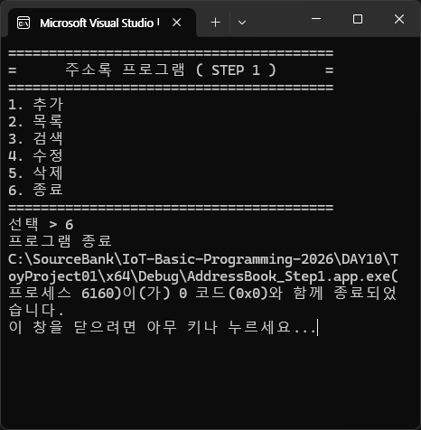

## 토이 프로젝트

### 주소록 프로그램

#### 개요
- C 기본기 학습 후 (구조체, 배열, 포인터, 파일 입출력, 문자열, 검색, 함수 등) 활용하는 묶음 프로젝트
- DB로 전향하기 전 가장 좋은 예제
- GUI(Graphic User Interface)는 추후에..
- TUI(Text User Interface)도 쉽지 않음

#### 목표 (ADT 근간)
- 연락처 추가/목록/수정/삭제/검색
- 파일 저장/로드
- (추가) 정렬/중복체크/csv 등 파일로 내보내기

#### 데이터 모델
- 이름(name), 전화번호(phone), 이메일(email), 주소(addr), 메모(memo)
- 구조체로 생성

### Step1
- 콘솔 메뉴와 기본 뼈대만 동작
    
    Step1 결과화면

### Step2
- AddressBook_Step1 폴더 복사
- 폴더 이름 변경
- 폴더 내 x64 폴더 삭제가능
- 폴더 내 .vcxproj(프로젝트 메인 파일), .filters, .user 파일명 변경
-VS2026에서 기존프로젝트로 추가

- 구조체, 배열 사용하여 1. 추가/ 2. 목록 구현하기
    
    Step2 결과화면

### Step3
- AddressBook_Step2 폴더 복사
- 이름으로 검색
- 이름 부분일치 ( 김 -> 김철수 -> 김민수 등 모두 검색)
- 결과가 없으면 안내메세지 출력
    
    Step3 결과화면

### Step4
- 연락처 수정, 삭제
- 삭제는 배열을 앞으로 당기는 처리 추가, count도 감소시켜줘야함.
    
    Step4 결과화면

### Step5
- 파일 저장 / 불러오기 ( 영구 저장 )
- 프로그램 실행 시 .txt파일 데이터 로드
- 프로그램 종료 시 .txt파일 데이터 저장
    
    Step5 결과화면

### Step6
- 정렬, 중복체크, | 입력 방지 작업
    
    Step6 결과화면

### Step7
- 동적 배열, 대용량 저장 - 100개 이상 저장
    
    Step7 결과화면

### Step8
- 분할 컴파일 및 UI 개선
    - AddressBook.h, AddressBook.c, main.c로 분리. 분할컴파일
    - 화면 clear 기능 추가
    
    Step8 결과화면